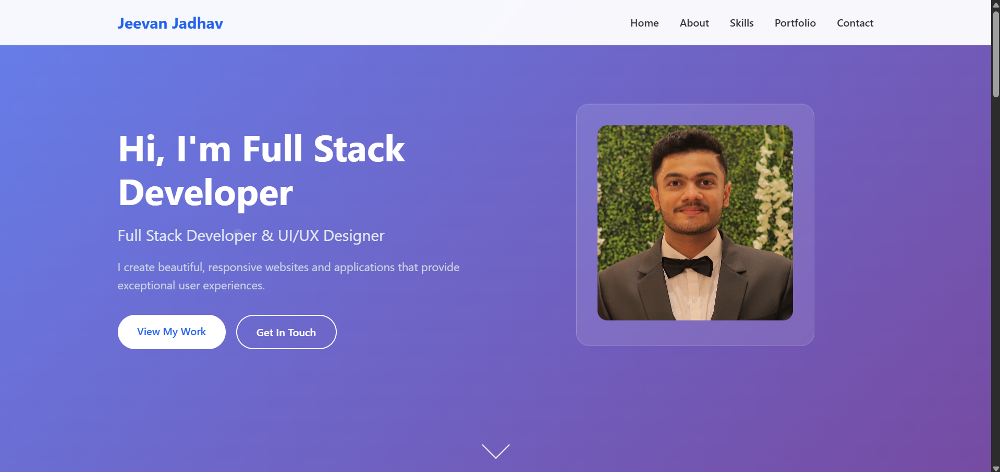
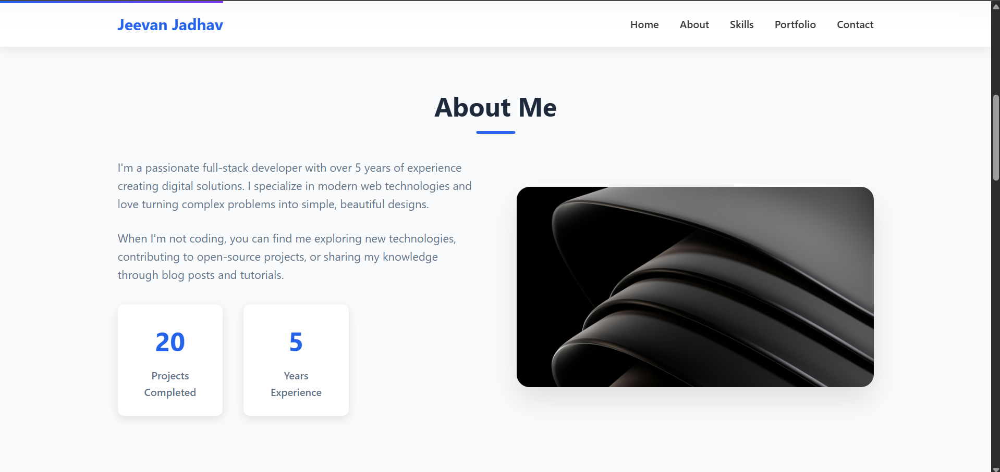

# Portfolio Template 4

A clean, single-page personal portfolio template built with plain HTML, CSS and JavaScript.  
This repository contains a lightweight, easily-customizable one-page portfolio you can use to showcase your projects, skills and contact information.

> **Repository:** `Portfolio-Template-4` by `NOVA0206`. (Files: `Portfolio4.html`, `style4.css`, `script4.js`, images, and `LICENSE` — MIT.) :contentReference[oaicite:0]{index=0}

---




You can view these images in the repository to get a quick visual of the template.

---

## Features

- Single-page portfolio layout (HTML + CSS + vanilla JavaScript).
- Lightweight and easy to customize.
- Comes with images used by the template (e.g. `Jeevan.jpg`, `Zhongli.jpg`, `bg.jpg`).
- Smooth scrolling / interactive behavior (handled in `script4.js`).
- MIT licensed (see `LICENSE`). :contentReference[oaicite:3]{index=3}

> File types present: `.html`, `.css`, `.js`, `.png`/`.jpg`. :contentReference[oaicite:4]{index=4}


---

## Getting started (how to run)

### Quick (no server required)
1. Clone the repository:
   ```bash
   git clone https://github.com/NOVA0206/Portfolio-Template-4.git
   cd Portfolio-Template-4
````

2. Open `Portfolio4.html` in your browser (double-click or `File -> Open`).

**VS Code Live Server:** right-click `Portfolio4.html` → "Open with Live Server".

---

## Customization guide

To make the template your own:

* **Replace images**: swap `Jeevan.jpg`, `Zhongli.jpg` and `bg.jpg` with your photos (keep names or update HTML accordingly).
* **Edit content**: open `Portfolio4.html` and update the text in sections (About, Projects, Contact, etc.).
* **Change styles**: modify `style4.css` for color, spacing, fonts and layout tweaks.
* **JS behavior**: update `script4.js` to change interactions (navigation, animations, or form handling).
* **Make it `index.html`**: rename `Portfolio4.html` → `index.html` if you want the site to load at the repo root on GitHub Pages.

---

## License

This project is licensed under the **MIT License**. See `LICENSE` for details. ([GitHub][1])

---

## Author / Credits

* Repository owner: **NOVA0206**
* Gmail: **jeevanj020604@gmail.com**
* Name: **Jeevan Jadhav**
